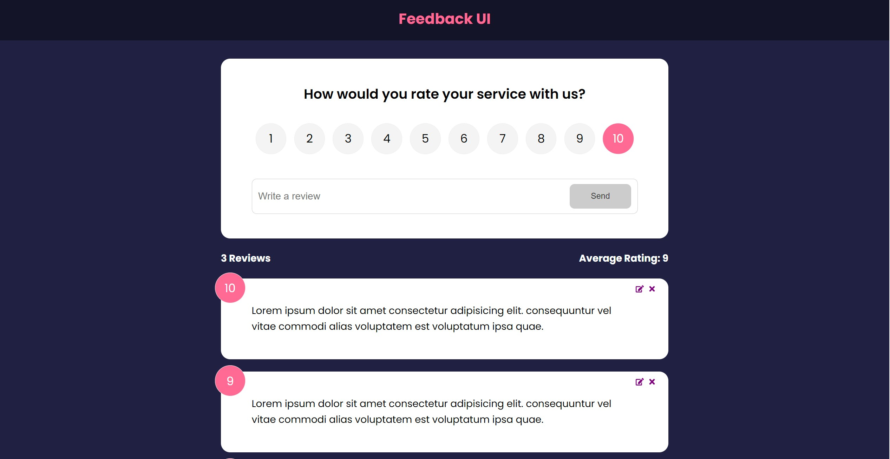

# Feedback/Rating application

This is the feedback app guided project from Brad Traversy's [Udemy course].(https://www.udemy.com/course/react-front-to-back-2022/learn/lecture/29765056?start=15#overview).

## Table of contents

-   [Overview](#overview)
    -   [The challenge](#the-challenge)
    -   [Screenshot](#screenshot)
    -   [Links](#links)
-   [My process](#my-process)
    -   [Built with](#built-with)
    -   [What I learned](#what-i-learned)
-   [Author](#author)

## Overview

### The challenge

Users should be able to:

-   Select a value between 1 and 10 to rate the product in mind
-   Enter a text input of no less than 10 characters to along with their review
-   Make edits to a review after it has been posted
-   View the average review of the product

### Screenshot

### Links

-   Solution URL: [https://lustrous-kitsune-f7c032.netlify.app/](https://lustrous-kitsune-f7c032.netlify.app/)

## My process

### Built with

-   Vite
-   [React](https://reactjs.org/) - JS library
-   React Icons
-   react-router-dom

### What I learned

This project really helped solidify my knowledge of state management (and the perils thereof). I gained experience using the useContext hook and more practice utilizing useState and useEffect. Also, I learned how to use Router, Route, and Route.

## Author

-   Website - [https://www.coolesthandluke.com](https://www.coolesthandluke.com)
